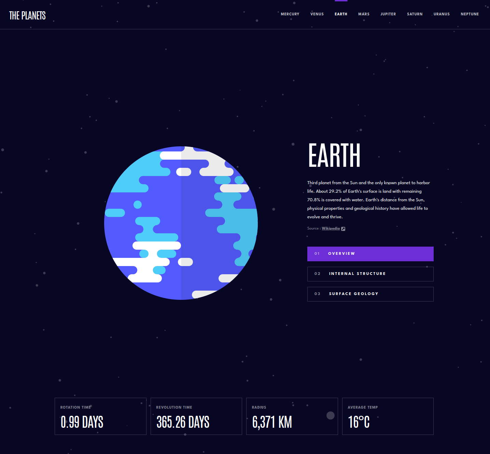

# Frontend Mentor - Planets fact site solution

This is a solution to the [Planets fact site challenge on Frontend Mentor](https://www.frontendmentor.io/challenges/planets-fact-site-gazqN8w_f). Frontend Mentor challenges help you improve your coding skills by building realistic projects.

## Table of contents

-   [Overview](#overview)
    -   [The challenge](#the-challenge)
    -   [Screenshot](#screenshot)
    -   [Links](#links)
-   [My process](#my-process)
    -   [Built with](#built-with)
    -   [What I learned](#what-i-learned)
-   [Author](#author)

**Note: Delete this note and update the table of contents based on what sections you keep.**

## Overview

### The challenge

Users should be able to:

-   View the optimal layout for the app depending on their device's screen size
-   See hover states for all interactive elements on the page
-   View each planet page and toggle between "Overview", "Internal Structure", and "Surface Geology"

### Screenshot

### Links

-   Solution URL: [Solution](https://www.frontendmentor.io/solutions/responsive-planets-facts-using-next-js-and-tailwind-NRL1gb5MrS)
-   Live Site URL: [Add live site URL here](https://frontendmentor-planets-indol.vercel.app/earth/overview)

## My process

### Built with

-   Semantic HTML5 markup
-   CSS custom properties
-   Flexbox
-   CSS Grid
-   Mobile-first workflow
-   [React](https://reactjs.org/) - JS library
-   [Next.js](https://nextjs.org/) - React framework
-   [Tailwind](https://tailwindcss.com/) - For styles

### What I learned

Here I learned some more advanced things on Tailwind, like theme customization and also on Next, about the routing system, how to handle route parameters, force static pages generation, and some others little things

## Author

-   Website - [https://jasonsavelli.fr](https://jasonsavelli.fr)
-   Frontend Mentor - [@Newpoki](https://www.frontendmentor.io/profile/Newpoki)
